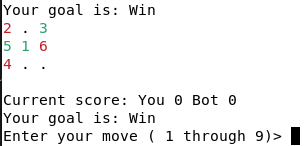

## CFR solver for SMBC's "Imperfect Information Tic Tac Toe"

For context, see the [SMBC comic](https://www.smbc-comics.com/comic/incomplete) or [Zach Weinersmith's original tweet](https://twitter.com/ZachWeiner/status/1537071654907564035).

This is a solver for the "Imperfect Information Tic Tac Toe" game which uses [Counterfactual Regret Minimization](http://modelai.gettysburg.edu/2013/cfr/cfr.pdf) to compute an unexploitable strategy (i.e. a [Nash Equilibrium](https://en.wikipedia.org/wiki/Nash_equilibrium)).

### Results
 - Each round of the game is advantaged to whoever goes second.  With optimal play, they can guarantee scoring a point 1/9 of the time more than their opponent.
 - Because of this, the game to 5 is also advantaged to whoever goes second. They will win on average 51.1% of the time with perfect play.
 - There is no pure strategy nash equilibrium.  In other words, you have to randomize your moves to do well at the game.
 - In the equilibrium found by this solver, the advantage for the second player comes from the case where the first player is trying to tie, and the second player is trying to win or lose. (There may be other strategies to achieve the same advantage).


### How to play the bot



If you want to experience pure frustration, you can play games against the pretrained bot included in this repository.

To do so, run 
```
$ cargo run --release --bin play_multiround -- -s solution_1e4/
```

### How to examine the bot's strategy

You can also see what the bot would do in any given situation, and see debug diagnostics about what it thinks about a certain state of the game.

To examine what the bot thinks when the score is 4-4 for example, run 

```
$ cargo run --release --bin explore -- -s solution_1e4/subgame_4_4
```

This will open an interactive prompt that displays information about a certain state of the game.

For example: 
```
Iteration 999
P1 Goal: Win P2 Goal: Win
2 3 . 
. 1 . 
. . . 

EV: 1 CF Prob 0.0007319205296642254 Parent CF Prob Some(0.1111111111111111)
Regrets: [-0.0000, -0.0000, -0.0000, -0.0000, -0.0000, -0.0000, ]

Infostate regrets [0.0, 0.0, 0.0, 0.0, 0.0, 0.0]
Total regrets [0.003776377397859841, 0.003776377397859841, 0.003776377397859841, 0.003776377397859841, 0.10521495732341031, 0.003776377397859841]
Current strategy [0.030430889832652092, 0.030430889832652092, 0.030430889832652092, 0.030430889832652092, 0.8478455508367396, 0.030430889832652092]
Average strategy [0.030430889832652092, 0.030430889832652092, 0.030430889832652092, 0.030430889832652092, 0.8478455508367396, 0.030430889832652092]
Best response value for P1 Some(3.122502256758253e-17) P2 Some(0.33482403263659605)
Best response strategy: [0.0, 0.0, 1.0, 0.0, 0.0, 0.0]
> 
```

- `Iteration 999` Tells us which iteration of the training we are examining.  Iteration 0 is before any learning has taken place.  You can change which iteration you are looking at by typing e.g. `i 990` which will switch to iteration 990.  The last iteration is usually the one you want to look at, unless you are debugging the training process.  You can see which iterations are available to load by looking at the files named `debug_X.bincode`, where X is the iteration number.
- `P1 Goal: Win P2 Goal: Win` Tells us that we are currently considering the case wher both player 1 (the first player) and player 2 (the second player) are trying to win this round. The bot's strategy depends on what its goal is.  To change what the current goal is, type e.g. `g w l`  Which will make player 1's goal be winning, and player 2's goal tying.
- The grid of numbers and dots:
```
2 3 . 
. 1 . 
. . . 
```
 corresponds to the sequence of moves made by each player in the game so far.  In this case, the first player went in the middle, the second player went in the top left corner, and the third player went in the top middle.  Note that even if the Xs and Os on the board are identical, the board state may be functionally different based on the *order* that the moves were played, since move order can give away information about a player's hidden goal.

 - `EV: 1` Tells us the "Expected Value" of player 1.  1.0 means a guaranteed victory for player 1, -1.0 means a guaranteed victory for player 2, in between means a chance of both.  This takes into account the current players goals, the state of the board, and the current players scores (i.e. based on which subgame you loaded).  Note: "Victory" means getting to 5 points, not winning this round.
 - `CF Prob 0.0007319205296642254 Parent CF Prob Some(0.1111111111111111)`  These are the "counterfactual probabilities" of reaching the current state for the current player, and the other player, respectively. These are used as a part of the CFR algorithm.
 - `Regrets: [-0.0000, -0.0000, -0.0000, -0.0000, -0.0000, -0.0000, ]` These are the per-action regrets from this state.  Only necessary for debugging the CFR algorithm.
 - `Infostate regrets [0.0, 0.0, 0.0, 0.0, 0.0, 0.0]` These are the per-action regrets for this state and all states which are indistinguishable from it.  Only necessary for debugging the CFR training algorithm.
 - `Total regrets [0.003776377397859841, 0.003776377397859841, 0.003776377397859841, 0.003776377397859841, 0.10521495732341031, 0.003776377397859841]`  These are the accumulated per-action regrets for this state and all states which are indistinguishable from it. These are used to determine the strategy for this iteration. Only necessary for debugging the CFR algorithm.
- `Current strategy [0.030430889832652092, 0.030430889832652092, 0.030430889832652092, 0.030430889832652092, 0.8478455508367396, 0.030430889832652092]`  This is the current strategy for this round of CFR.  Each number corresponds to the probability of taking a given action.  Note: Actions which are effectively duplicate due to symmetry of the tic tac toe board are ignored.  IMPORTANT: This is not the strategy which converges to a nash equilibrium.  Only `Average strategy` Is guaranteed to converge to a nash equilibrium, but in practice the Current Strategy and Average strategy are usually nearly identical by the end of training.
- `Average strategy [0.030430889832652092, 0.030430889832652092, 0.030430889832652092, 0.030430889832652092, 0.8478455508367396, 0.030430889832652092]`  Tells us the per-action probability of the optimal (nash equilibrium) strategy.  For example, in this case, the 5th action is taken with 84.7% probability, with the remaining 5 actions having equal probability.  In this position the 5th action corresponds with moving in the bottom middle position. Note: Actions which are effectively duplicate due to symmetry of the tic tac toe board are ignored.
- `Best response value for P1 Some(3.122502256758253e-17) P2 Some(0.33482403263659605)` These represent the expected value of the "best response" strategy playing against the bot from this state.  These will only appear if you run the `best_response` program to calculate this date.
- `Best response strategy: [0.0, 0.0, 1.0, 0.0, 0.0, 0.0]` These represent the "best response" strategy playing against the bot from this state.  These will only appear if you run the `best_response` program to calculate this data.  In this case, the 3rd action is the best response, i.e. right middle.

To make a move on the board you can enter e.g. `m 3` which will move at position `3` on the grid (top right).  The position numbering is like on a phone keypad:

```
1 2 3
4 5 6
7 8 9
```
   To undo a move, you can enter `u`.  To quit, you can enter `q`.

### How to train the bot

Although this repository already includes a pretrained bot, you can also run the solver yourself.

To do so, run

```
$ cargo run --release --bin solve_multiround -- -o my_solution/
```

The training progress will be output to the terminal, and the trained bot will be output to the directory `my_solution/`

The solver goes through each round, from last to first, and attempts to solve it based on the previously solved rounds.  For example, it will first begin solving the game where both players have a score of 4.  Once this is solved within the exploitability bound, it will attempt to solve the subgames where the score is 4-3 and 3-4 simultaneously, etc.

There are a number of parameters you can modify to adjust the training process

 - `--maximum-subgame-exploitability` is a small floating point value greater than 0.  Each subgame (round) will be solved within this degree of exploitability.  e.g. if this argument is `0.01`, the solver will solve until it is impossible to get a 1% "edge" against the the computed strategy.  Larger values will be faster to solve, but give less optimal solutions. By default this is `0.000001`.  (Note that I don't have a proof that my mechanism for solving will bound the overall exploitability of the game to 5, but in practice it does).
 - `--check-exploitability-every` Tells the solver how often to check whether a subgame has converged.  It takes time to check if a subgame has converged, so by default we only do it every `10` iterations.
 - `--winning-score` is the number of points the game is played to.  By default `5` like in the SMBC comic.
 - `--discount true` enables discounting as in the [Discounted CFR paper](https://arxiv.org/abs/1809.04040). This is enabled by default.  `--discount-alpha`, `--discount-beta` and `--discount-gamma` may also be tweaked from their default values which are copied from the paper.  Disabling `--discount` will cause the solver to use vanilla CFR, which is slower.
 - `--small-move-epsilon` and `--small-move-epsilon-decay` are options I was experimenting with to attempt to regularize the strategy that the solver learns.  For example, if move 1 and move two have the same expected value, I would rather learn a strategy that picks move 1 100% of the time, rather than move 1 some of the time and move 2 some of the time, since the resulting strategy is simpler to understand.  The "small-move-epsilon" is a bonus added to the score that rewards the players for playing "smaller" moves, i.e. moves which are closer to the upper left hand corner.  `--small-move-epsilon-decay` is used to modify reward after each iteration, e.g. if `small-move-epsilon-decay`is 0.01, then after each iteration `small-move-epsilon` will be reduced to be 0.99 times its value the previous iteration.  In my experiments these options did help with regularization, but nowhere near enough to arrive at an analytical solution.
 - `--alternate-updates true` enables "alternating updates" in the CFR algorithm.  This is how CFR+ and Discounted CFR both work, as these papers report that alternating updates result in faster convergence.   This is enabled by default.

 ### How to validate your trained bot

Included in this repository are utilities to calculate the best response to a given strategy.  This allows us to calculate the exploitability of our strategy, i.e. how well a perfect player can do against our trained bot.

To evaluate how exploitable the included full multi-round solution is, run

```
$ cargo run --release --bin best_response_multiround -- -s solution_1e4/
```

This will compute the overall exploitability of the game.  Note that when solving we bound the exploitability of the subgames, but the overall exploitability may be higher than the exploitability of any subgame.

There is also a tool (`best_response_subgame`) for computing the exploitability of a single round, ignoring the multi-round nature of the game.


 ### How it Works

Counterfactual Regret Minimization gives us an efficient way of solving imperfect information games with finite game trees. Versions of it have been used to solve games like Poker.  If we were just solving a single round of imperfect information tic tac toe, without alternating turns, we could use CFR to directly solve the game.  This is what solve_subgame.rs does:  compute a nash equilibrium for a 1 round game, where the only thing to optimize is my probability of winning vs my opponent's probability of winning.

HOWEVER, in the multiround version, there is some recurrence of states.  For example, if two games in a row, neither player achieves their goal, we end up back in the same state we started out in.  There may be a way to nicely adapt CFR to this case, but I am not aware of it.  The way we handle this is to break the problem into subgames, where each subgame can be solved using CFR, *conditional on knowing the value of the outcomes*.

For example, if both players have a score of 4, then an outcome of (+1, +0) is a win for player 1 (so value 1.0), (+0, +1) is a win for player 2 (so value -1.0), but an outcome of (+1, +1) or (+0, +0) gets us back to the same state we started in, so its value is *the same as the overall value of the subgame itself*.  This is a recursive dependency of the subgame value on itself.  To handle this, we just initialize the subgame value to 0, and alternate between solving the subgame, and updating the outcome values.

Note that if the score is (first player: 1, second player:2) and if the outcome is (+0, +0) then the players switch places, the new game state is (first player:2, second player:1), and vice versa.  Thus we must solve these pairs (a,b) and (b,a) simultaneously.

By working backwards from (4,4), we can solve each subgame based on its "twin" which we are solving simultaneously, and the later subgames, which we have already completely solved.


### Notes

- Directly solving the full game to 5 with CFR by explicitly adding the player scores to the game state would work, but it would result in a much larger set of game states.  It would also require more careful handling of "chance" nodes in the game tree, since if we naively expanded each possible of assignments of goals after each round, it would blow up the number of game states to an unmanageable level (probably monte carlo CFR would be necessary).
- I am not sure how to bound the overall exploitability of the agent based on the exploitability of the subgames. It seems likely there is some way to do it in the literature that I haven't found.
- I attempted to use regularization to find a strategy that could be rounded to an analytical solution, but was unable to do so, thus disqualifying me from the 4 trillion nanacoin reward specified in the SMBC votey.
- The included solution was solved to an exploitability of < 0.0001 per subgame, and took me a weekend of computation.  The total exploitability is 0.00058, i.e. with perfect play you will beat the bot 51.11% of the time as player 2, and the bot would only beat you 51.08% of the time as player 2.
- This code is not as optimized as it could be, if you want to solve the game to lower exploitability, it would likely be worth your time to improve the performance.
- Don't judge my ugly code.
- Notice me Zach Weinersmith!

### References

- [Counterfactual Regret Minimization](http://modelai.gettysburg.edu/2013/cfr/cfr.pdf)  This was my main reference for implementing CFR.
- [Discounted Counterfactual Regret Minimization](https://arxiv.org/abs/1809.04040) This was the paper I followed for implementing discounting.